<!--Encabezado-->

 <!--Numero de los visitantes al perfil-->

<div style="text-align: right"></div> <!--Estilo-->

 <!--Logo-->

<a href="https://app.daily.dev/francislucanoleonelguzman"></a> <!--Tarjeta de Daily.dev-->

<p align="center"></p> <!--Textos con animacion-->

<!--Redes sociales-->

##  Connect with me...

<a href="https://www.linkedin.com/in/francis-lucano-leonel-guzm%C3%A1n-44b311263/"></a>
<a href="mailto:francislucanoleonelguzman@gmail.com"></a>
<a href="https://github.com/FrancisLucanoLeonelGuzman"></a>
<a href="https://www.instagram.com/francis.guzman_/"></a>
<a href="https://t.me/FrancisLucanoLeonelGuzman" target="_blank"></a>
<a href="https://dev.to/francislucanoleonelguzman"></a>

 <!--Barra animada-->

<!--Mis objetivos para este 2023-->

##  Objectives for this 2023...

- 🏆 Being able to consolidate my knowledge and apply it in projects
- 💪 Continue studying and perfecting as a developer
- 😍 Enjoy this 2023 with my people
- 😏 Keep improving my English

 <!--Barra animada-->

###  A little more about me... <!--Un poco mas sobre mi-->

<!--Un poco sobre mi-->

```solidity
// A little more about me...
pragma solidity 20.23;

contract Profile {
    string public name = "Francis Lucano Leonel Guzman";
    string public pronouns = "Francis | Fran";

    string[] internal skills;

    function getSkills() public returns (string[] memory) {
        skills = [
            "JavaScript",
            "Java",
            "PHP",
            "HTML",
            "CSS"
        ];

        return skills;
    }

    function fun() public view returns (string memory) {
        return
            "if you can imagine it can be programmed";
    }
}

```

---

<!--Sobre mi-->
### <h2 align="center">🤹 About me 🤹</h2>

👋 ¡Hello! 👋 I am Francis Lucano Leonel Guzman, I am 22 years old, I currently live in Argentina (La Rioja capital). I am a JavaScript and PHP developer. 2022 I started studying development in Java and PHP. Developed in PHP for a company in California. I am very constant and passionate. Which always helps me go all the way in the things I do. Thanks to this I have learned to pay attention to the needs to develop in the most efficient and useful way. Thanks for reading anything you want to know about me don't hesitate to ask me. I hope you have a nice day and good luck. 😊❤

---

<!--Mis skills como desarrollador-->

### <h2 align="center">  My Skill Set  </h2>

<div align="center">
<br>

  


</div>

<br>

---

<!--Mis estadisticas de GitHub-->

###  Github Stats

<details>
<summary>Expand</summary>
<br>


    
</details>

---

<!--Estadisticas Github Streak-->

### 🔥 GitHub Streak

<details>
<summary>Expand</summary>
<br>

[](https://git.io/streak-stats)

</details>

---

<!--Mis trofeos-->

### 🏆 GitHub Trophy

<details>
<summary>Expand</summary>
<br>

[](https://github.com/ryo-ma/github-profile-trophy)

</details>

---
<!--Mi lista de Spotify-->
###  My Spotify

<details>
<summary>Expand</summary>
<br>
    
<a href="https://open.spotify.com/playlist/37i9dQZF1DWWQRwui0ExPn"> <!--Una de las listas que mas utilizo cuando estoy desarrollando-->
    

</details>

---

<br>
 <!--Calendario con efecto snake-->
<br>

<!--Final de la pagina-->

</img>

<!--
**FrancisLucanoLeonelGuzman/FrancisLucanoLeonelGuzman** is a ✨ _special_ ✨ repository because its `README.md` (this file) appears on your GitHub profile.

Here are some ideas to get you started:

- 🔭 I’m currently working on ...
- 🌱 I’m currently learning ...
- 👯 I’m looking to collaborate on ...
- 🤔 I’m looking for help with ...
- 💬 Ask me about ...
- 📫 How to reach me: ...
- 😄 Pronouns: ...
- ⚡ Fun fact: ...
-->
