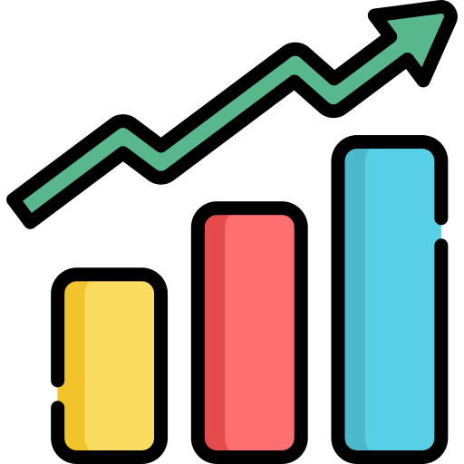

<!-- Encabezado -->

<!-- Numero de los visitantes al perfil -->
<div align="Left">
  
</div>

<!-- Titulo Principal (con animacion) -->
<p align="center"></p>

<!-- Espaciado antes de la siguiente sección -->
<br>

<!-- Foto Banner -->


<!--Tarjeta de Daily.dev-->
<a href="https://app.daily.dev/francislucanoleonelguzman"></a>

<!-- Encabezado con Tabla para evitar líneas horizontales -->
<table border="0">
  <tr>
    <td width="70%" border="0">
      <!-- Título -->
      <h2>
         
        Connect with me...
      </h2>
      <!-- Redes Sociales -->
      <a href="https://www.linkedin.com/in/francis-lucano-leonel-guzm%C3%A1n-44b311263/">
        
      </a>
      <a href="mailto:francislucanoleonelguzman@gmail.com">
        
      </a>
      <a href="https://github.com/FrancisLucanoLeonelGuzman">
        
      </a>
      <a href="https://www.instagram.com/francisllguzman/">
        
      </a>
      <a href="https://t.me/FrancisLucanoLeonelGuzman">
        
      </a>
      <a href="https://dev.to/francisllguzman">
        
      </a>
    </td>
  </tr>
</table>

<!-- Espaciado antes de la siguiente sección -->
<br>

<!--Mis objetivos para este 2026-->
<table border="0">
<tr>
<td width="70%" border="0">
<h2>
<!-- Titulo -->
 Objectives for this 2026...
</h2>
</td>
</tr>
</table>

- 🏆 **Knowledge:** Consolidating my knowledge and applying it in real projects.
- 💪 **Development:** Continue studying and perfecting as a developer.
- 😍 **Connection:** Enjoying this 2026 with my people.
- 😏 **English:** Keep improving my English and technical communication.

<!--Un poco mas sobre mi-->
###  A little more about me... 
---

```solidity
// A little more about me...
pragma solidity 20.23;

contract Profile {
    string public name = "Francis Lucano Leonel Guzman";
    string public pronouns = "Francis | Fran";

    string[] internal skills;

    function getSkills() public returns (string[] memory) {
        skills = [
            "JavaScript",
            "Java",
            "PHP",
            "HTML",
            "CSS"
            "C"
        ];

        return skills;
    }

    function fun() public view returns (string memory) {
        return
            "If you can imagine it, you can program it";
    }
}

```
<!-- Espaciado antes de la siguiente sección -->
<br>

<!--Sobre mi-->
### <h2 align="center">🤹 About me 🤹</h2>

👋 ¡Hello! 👋 I'm **Francis Lucano Leonel Guzman**, I'm 25 years old and I live in La Rioja, Argentina. I am currently in my second year of **Systems Engineering at the National University of La Rioja**. I started my coding journey back in 2022. I began with **JavaScript**, then moved on to **Java** and **PHP**. I’m passionate about what I do and I always try to go all the way to achieve my goal. I make sure that everything I build isn’t just functional, but also efficient and genuinely useful. Thanks for stopping by! If you want to talk about a project or just say hi, feel free to reach out. Hope you have a great day! 😊❤

<!-- Espaciado antes de la siguiente sección -->
<br>

<!--Mis skills como desarrollador-->
<div align="center">
  <h2>
    
    <span style="vertical-align: middle;"> My Skill Set </span>
    
  </h2>
  <a href="https://skillicons.dev">
    
  </a>
</div>

<!-- Espaciado antes de la siguiente sección -->
<br>

<!--Mis estadisticas de GitHub-->
###  Github Stats

<details>
<summary>Expand</summary>
<br>


    
</details>

---

<!--Estadisticas Github Streak-->
### 🔥 GitHub Streak

<details>
<summary>Expand</summary>
<br>

[](https://git.io/streak-stats)

</details>

---

<!--Mis trofeos-->
### 🚀 Recent Activity
<details>
  <summary>Expand</summary>
  <br />

<!--START_SECTION:activity-->
<!--END_SECTION:activity-->
  
</details>

---

<!--Mi música de YouTube-->
<div align="left">
  <h3>
    
    <span style="vertical-align: middle;"> My YouTube Playlist </span>
  </h3>
</div>

<details>
  <summary align="left">Expand</summary>
  <br>
  <div align="left">
    <a href="https://www.youtube.com/watch?v=sF80I-TQiW0&t=2s">
      
    </a>
        <a href="https://www.youtube.com/watch?v=u0n6Fun_pY8">
      
    </a>
        </a>
        <a href="https://www.youtube.com/watch?v=Zb7tVtuuXjY&t=1000s">
      
    </a>
  </div>
</details>

---

<!-- Espaciado antes de la siguiente sección -->
<br>

<!--Calendario con efecto snake-->
<div align="center">
  <h3>
    
    <span style="vertical-align: middle;"> Mis contribuciones devoradas por Pac-Man </span>
  </h3>
  
  
</div>

<!--
**FrancisLucanoLeonelGuzman/FrancisLucanoLeonelGuzman** is a ✨ _special_ ✨ repository because its `README.md` (this file) appears on your GitHub profile.

Here are some ideas to get you started:

- 🔭 I’m currently working on ...
- 🌱 I’m currently learning ...
- 👯 I’m looking to collaborate on ...
- 🤔 I’m looking for help with ...
- 💬 Ask me about ...
- 📫 How to reach me: ...
- 😄 Pronouns: ...
- ⚡ Fun fact: ...
-->
